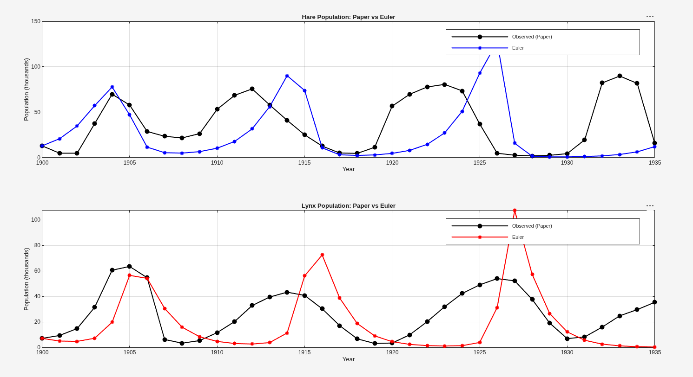
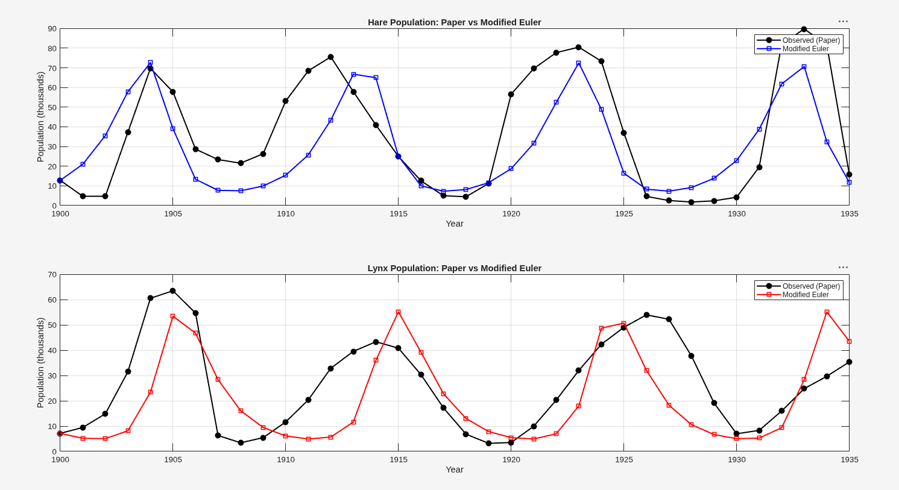
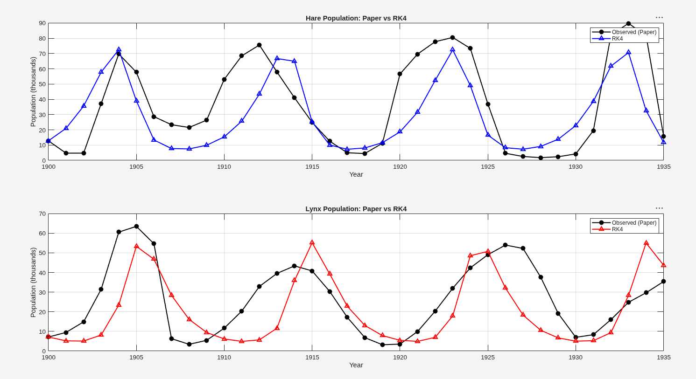
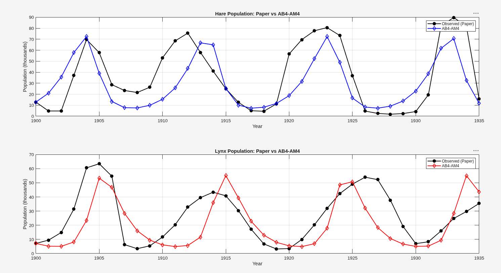
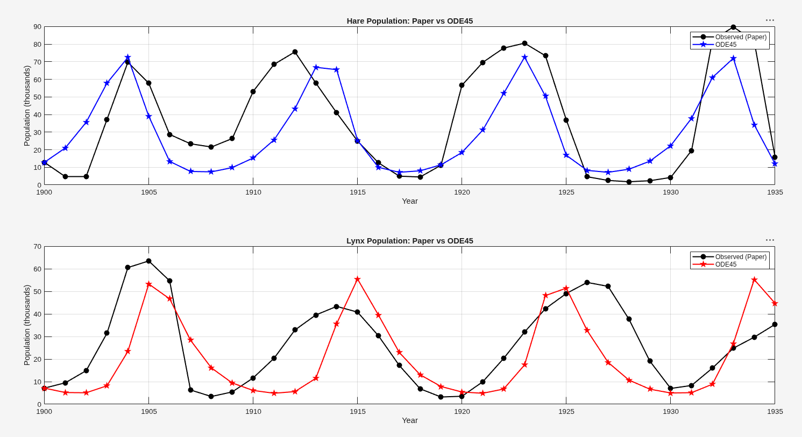
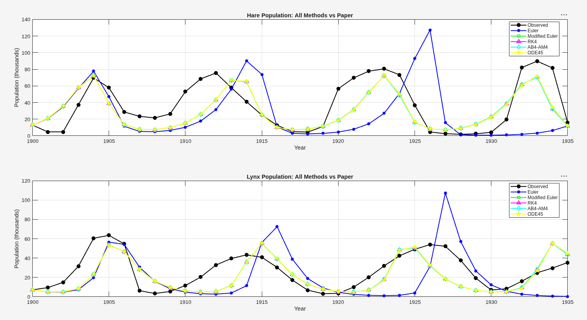

# Numerical Solutions of the Lotka-Volterra Predator-Prey Model: A Comprehensive Analysis

## Introduction
The paper explores the fascinating dynamics between predators and prey using the classic Lotka-Volterra mathematical model. Specifically, it looks at the historical populations of snowshoe hares (the prey) and Canada lynx (the predator) in Northern Canada between 1900 and 1935, based on trapping records from the Hudson Bay Company. 

In simple terms, the relationship is a continuous game of cat and mouse. When there are plenty of hares, the lynx have abundant food, so their population grows. However, as the lynx population grows, they eat more hares, causing the hare population to crash. With fewer hares to eat, the lynx begin to starve and their numbers decline. This gives the surviving hares a chance to recover and multiply again, starting the cycle all over. This creates a beautiful, repeating "boom and bust" wave in both populations.

## The Lotka-Volterra Equations
The model uses two connected Ordinary Differential Equations (ODEs) to describe this ecological cycle mathematically:

1. **Hare (Prey) Equation:**
   $$ \frac{dx}{dt} = \alpha x - \beta xy $$
   - **$x$**: Number of hares.
   - **$\alpha x$**: How fast hares reproduce when left alone to eat and breed.
   - **$-\beta xy$**: How fast hares are hunted and eaten by lynx (based on encounters between the two).

2. **Lynx (Predator) Equation:**
   $$ \frac{dy}{dt} = \delta xy - \gamma y $$
   - **$y$**: Number of lynx.
   - **$\delta xy$**: How fast lynx reproduce, which is entirely dependent on the hares they eat.
   - **$-\gamma y$**: How fast lynx naturally die off when there are no hares around to feed them.

Using an optimization algorithm called Simulated Annealing, the paper found the perfect parameters to make the math match the real historical data: 
$\alpha = 0.6923$, $\beta = 0.0333$, $\gamma = 0.7627$, $\delta = 0.02684$.

## How the Paper Solved It
The paper tackled this complexity in two ways:
1. **Analytically (The Ritz Method):** They used an advanced approximation technique to find a closed-loop, elliptical formula that roughly describes the waves. It's great for understanding the theory and proving that the cycle repeats, but it struggles to capture sharp, realistic changes in the wild.
2. **Numerically (Runge-Kutta 4):** This method is incredibly accurate and forms the basis for how we simulate complex chaotic systems today.

In our project, we took the numerical approach much further by implementing and comparing five different computational methods to see which one performs best against the real historical data!

## Numerical Methods Implemented

Here are the specific computational methods we used to step through time (where $h$ is our time step, $0.1$ years):

### 1. Explicit Euler Method
The absolute simplest method. It just calculates the slope at the current moment and draws a straight line to the next point.
$$ y_{n+1} = y_n + h \cdot f(t_n, y_n) $$

### 2. Modified Euler (Heun's Method)
A smarter, second-order approach. It averages the slope at the beginning of the step and the estimated slope at the end of the step.
$$ \tilde{y} = y_n + h \cdot f(t_n, y_n) $$
$$ y_{n+1} = y_n + \frac{h}{2} [f(t_n, y_n) + f(t_{n+1}, \tilde{y})] $$

### 3. Fourth-Order Runge-Kutta (RK4)
The gold standard for everyday engineering. It calculates the slope at four different points within the step and takes a carefully weighted average to move forward.
$$ k_1 = h \cdot f(t_n, y_n) $$
$$ k_2 = h \cdot f(t_n + \frac{h}{2}, y_n + \frac{k_1}{2}) $$
$$ k_3 = h \cdot f(t_n + \frac{h}{2}, y_n + \frac{k_2}{2}) $$
$$ k_4 = h \cdot f(t_n + h, y_n + k_3) $$
$$ y_{n+1} = y_n + \frac{1}{6}(k_1 + 2k_2 + 2k_3 + k_4) $$

### 4. Adams-Bashforth-Moulton (AB4-AM4) Predictor-Corrector
An advanced multi-step method. Instead of just looking at the current moment, it uses the history of the last four points to "predict" the next point (AB4), and then uses that prediction to "correct" and refine the final answer (AM4).
**Predictor (AB4):**
$$ y_{pred} = y_n + \frac{h}{24} [55 f_n - 59 f_{n-1} + 37 f_{n-2} - 9 f_{n-3}] $$
**Corrector (AM4):**
$$ y_{n+1} = y_n + \frac{h}{24} [9 f(t_{n+1}, y_{pred}) + 19 f_n - 5 f_{n-1} + f_{n-2}] $$

### 5. MATLAB's Built-In ODE45
MATLAB's professional-grade solver. It uses an adaptive Runge-Kutta method (Dormand-Prince) that automatically shrinks or grows the step size $h$ dynamically to guarantee a specific level of mathematical precision.

---

## Results and Comparisons

### Table 1: Hare Population Comparison
| Year | Observed (Paper) | Euler | Modified Euler | RK4 | AB4-AM4 | ODE45 |
|------|------------------|-------|----------------|-----|---------|-------|
| 1900 | 12.82 | 12.8200 | 12.8200 | 12.8200 | 12.8200 | 12.8200 |
| 1901 | 4.72 | 20.7044 | 20.9830 | 20.9846 | 20.9846 | 20.9805 |
| 1902 | 4.73 | 34.7769 | 35.5471 | 35.5520 | 35.5520 | 35.5515 |
| 1903 | 37.22 | 57.0402 | 57.8472 | 57.8382 | 57.8381 | 57.8406 |
| 1904 | 69.72 | 77.6809 | 72.6611 | 72.5354 | 72.5354 | 72.4537 |
| 1905 | 57.78 | 46.9532 | 39.0514 | 39.0714 | 39.0706 | 39.0284 |
| 1906 | 28.68 | 11.4281 | 13.3698 | 13.3995 | 13.3997 | 13.3586 |
| 1907 | 23.37 | 5.2640 | 7.7302 | 7.7380 | 7.7381 | 7.6504 |
| 1908 | 21.54 | 4.8447 | 7.5076 | 7.5078 | 7.5080 | 7.4296 |
| 1909 | 26.34 | 6.4389 | 9.9217 | 9.9173 | 9.9175 | 9.8320 |
| 1910 | 53.10 | 10.2294 | 15.4025 | 15.3938 | 15.3940 | 15.2860 |
| 1911 | 68.48 | 17.6646 | 25.7329 | 25.7195 | 25.7199 | 25.5695 |
| 1912 | 75.58 | 31.5355 | 43.4207 | 43.3994 | 43.3997 | 43.2778 |
| 1913 | 57.92 | 55.9889 | 66.7839 | 66.7223 | 66.7218 | 66.8348 |
| 1914 | 40.97 | 90.1265 | 64.9947 | 64.9059 | 64.9056 | 65.4789 |
| 1915 | 24.95 | 73.8127 | 25.0780 | 25.1623 | 25.1611 | 25.3284 |
| 1916 | 12.59 | 10.6434 | 10.0311 | 10.0560 | 10.0563 | 9.9842 |
| 1917 | 4.97 | 2.9673 | 7.2758 | 7.2803 | 7.2807 | 7.1771 |
| 1918 | 4.50 | 2.2697 | 8.1455 | 8.1411 | 8.1414 | 8.0084 |
| 1919 | 11.21 | 2.8472 | 11.6154 | 11.6030 | 11.6035 | 11.4204 |
| 1920 | 56.60 | 4.4875 | 18.7069 | 18.6846 | 18.6853 | 18.4119 |
| 1921 | 69.63 | 7.8583 | 31.6138 | 31.5778 | 31.5788 | 31.1607 |
| 1922 | 77.74 | 14.4396 | 52.4179 | 52.3594 | 52.3604 | 51.9328 |
| 1923 | 80.53 | 27.0750 | 72.5009 | 72.3940 | 72.3927 | 72.5847 |
| 1924 | 73.38 | 50.8893 | 48.9807 | 49.0585 | 49.0552 | 50.3962 |
| 1925 | 36.93 | 92.8184 | 16.4569 | 16.5348 | 16.5341 | 16.8382 |
| 1926 | 4.64 | 127.3155 | 8.2872 | 8.3048 | 8.3051 | 8.2457 |
| 1927 | 2.54 | 15.6453 | 7.3090 | 7.3086 | 7.3091 | 7.1639 |
| 1928 | 1.80 | 1.3842 | 9.1588 | 9.1473 | 9.1481 | 8.9149 |
| 1929 | 2.39 | 0.6710 | 13.8437 | 13.8194 | 13.8205 | 13.4678 |
| 1930 | 4.23 | 0.7055 | 22.8837 | 22.8413 | 22.8431 | 22.2882 |
| 1931 | 19.52 | 1.0405 | 38.7539 | 38.6855 | 38.6880 | 37.8604 |
| 1932 | 82.11 | 1.7850 | 61.8352 | 61.7319 | 61.7337 | 61.0238 |
| 1933 | 89.76 | 3.2786 | 70.6795 | 70.6087 | 70.6044 | 71.9608 |
| 1934 | 81.66 | 6.2121 | 32.4186 | 32.5973 | 32.5911 | 34.2045 |
| 1935 | 15.76 | 11.9374 | 11.6856 | 11.7416 | 11.7411 | 11.9283 |

### Table 2: Lynx Population Comparison
| Year | Observed (Paper) | Euler | Modified Euler | RK4 | AB4-AM4 | ODE45 |
|------|------------------|-------|----------------|-----|---------|-------|
| 1900 | 7.13 | 7.1300 | 7.1300 | 7.1300 | 7.1300 | 7.1300 |
| 1901 | 9.47 | 5.0746 | 5.1746 | 5.1755 | 5.1755 | 5.1782 |
| 1902 | 14.86 | 4.8055 | 5.0633 | 5.0665 | 5.0665 | 5.0657 |
| 1903 | 31.47 | 7.2571 | 8.1511 | 8.1611 | 8.1612 | 8.1801 |
| 1904 | 60.57 | 19.8207 | 23.3922 | 23.4015 | 23.4010 | 23.3978 |
| 1905 | 63.51 | 56.5163 | 53.4537 | 53.3266 | 53.3283 | 53.2944 |
| 1906 | 54.70 | 54.1966 | 46.7794 | 46.7873 | 46.7866 | 46.7221 |
| 1907 | 6.30 | 30.5990 | 28.3604 | 28.3844 | 28.3843 | 28.3725 |
| 1908 | 3.41 | 15.9271 | 16.1214 | 16.1339 | 16.1340 | 16.0927 |
| 1909 | 5.44 | 8.4205 | 9.4478 | 9.4532 | 9.4533 | 9.4078 |
| 1910 | 11.65 | 4.7818 | 6.1382 | 6.1408 | 6.1409 | 6.0961 |
| 1911 | 20.35 | 3.1493 | 4.9038 | 4.9056 | 4.9057 | 4.8583 |
| 1912 | 32.88 | 2.7350 | 5.6758 | 5.6778 | 5.6780 | 5.5848 |
| 1913 | 39.55 | 3.8558 | 11.6197 | 11.6209 | 11.6214 | 11.4527 |
| 1914 | 43.36 | 11.4163 | 35.9950 | 35.9052 | 35.9047 | 35.7009 |
| 1915 | 40.83 | 56.1477 | 55.2278 | 55.1623 | 55.1622 | 55.4936 |
| 1916 | 30.36 | 72.5073 | 39.2153 | 39.2624 | 39.2614 | 39.5411 |
| 1917 | 17.18 | 38.7566 | 22.7921 | 22.8271 | 22.8268 | 22.9378 |
| 1918 | 6.82 | 18.8422 | 13.0026 | 13.0199 | 13.0199 | 13.0426 |
| 1919 | 3.19 | 9.1498 | 7.8563 | 7.8643 | 7.8644 | 7.8442 |
| 1920 | 3.52 | 4.5767 | 5.4482 | 5.4519 | 5.4520 | 5.4049 |
| 1921 | 9.94 | 2.4477 | 4.9112 | 4.9123 | 4.9126 | 4.8388 |
| 1922 | 20.30 | 1.4936 | 6.9496 | 6.9459 | 6.9466 | 6.7352 |
| 1923 | 31.99 | 1.1704 | 17.9389 | 17.9054 | 17.9070 | 17.4100 |
| 1924 | 42.36 | 1.4515 | 48.7172 | 48.5316 | 48.5332 | 48.1628 |
| 1925 | 49.08 | 3.9755 | 50.7491 | 50.7771 | 50.7745 | 51.4556 |
| 1926 | 53.99 | 31.3954 | 32.0439 | 32.1118 | 32.1103 | 32.6423 |
| 1927 | 52.25 | 107.3689 | 18.2792 | 18.3191 | 18.3185 | 18.5694 |
| 1928 | 37.70 | 57.2563 | 10.5772 | 10.5967 | 10.5966 | 10.6916 |
| 1929 | 19.14 | 26.6099 | 6.6670 | 6.6760 | 6.6761 | 6.6718 |
| 1930 | 6.98 | 12.2689 | 5.0273 | 5.0307 | 5.0309 | 4.9679 |
| 1931 | 8.31 | 5.6849 | 5.2639 | 5.2618 | 5.2623 | 5.1099 |
| 1932 | 16.01 | 2.6727 | 9.3757 | 9.3563 | 9.3580 | 8.8658 |
| 1933 | 24.82 | 1.2949 | 28.3853 | 28.2591 | 28.2627 | 26.8694 |
| 1934 | 29.70 | 0.6658 | 55.1899 | 55.0608 | 55.0614 | 55.2599 |
| 1935 | 35.40 | 0.3840 | 43.5698 | 43.6604 | 43.6563 | 44.7406 |

### Overall Accuracy: Root Mean Square Error (RMSE)
The RMSE tells us how far off our predictions were from the actual historical trapping data. A lower score is better, meaning the mathematical method was closer to reality!
| Method | RMSE (Hares) | RMSE (Lynx) |
|--------|--------------|-------------|
| Explicit Euler | 42.9870 | 24.3048 |
| Modified Euler (Heun) | 21.5157 | 15.6792 |
| RK4 | 21.5037 | 15.6699 |
| AB4-AM4 | 21.5042 | 15.6699 |
| ODE45 | 21.3884 | 15.7036 |

---

## Visualizations

### 1. Paper vs Explicit Euler

   

### 2. Paper vs Modified Euler

   

### 3. Paper vs RK4

   

### 4. Paper vs AB4-AM4

   

### 5. Paper vs ODE45

   

### 6. Comprehensive Comparison (All Methods)

   
